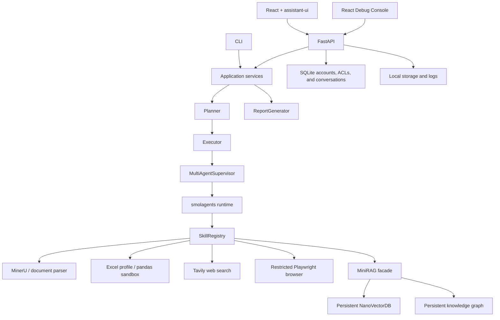

# Qwopus-Agent

Qwopus-Agent is a local-first, modular AI Agent framework for document analysis,
tool use, persistent knowledge, research, reusable Skills, and supervised
Multi-Agent workflows. It is optimized for Apple Silicon and MLX, while the
Agent core remains independent from any model family.

The repository contains a React application, a FastAPI backend, a local Debug
Console, and independently testable Python modules. It is a local-first
multi-account application: each account owns its chats and documents, while a
chat owner can explicitly share that chat and its attached files.

## What Works

| Area | Current implementation |
| --- | --- |
| Model layer | `BaseLLM`, provider registry, `LocalMLXLLM`, and a generic OpenAI-compatible adapter |
| Agent runtime | smolagents-driven chat, separate Planner and Executor, DAG execution, supervised Multi-Agent delegation, shared state, debate, and arbitration |
| Documents | Multi-file PDF, DOCX, Markdown, TXT, PNG, and JPEG analysis with Markdown normalization |
| Spreadsheets | CSV, XLSX, and legacy XLS intake, workbook structure profiling, bounded samples, LLM-generated pandas, and local restricted execution |
| Knowledge | Persistent conversation-scoped MiniRAG vectors plus an evidence-bound knowledge graph and bounded multi-hop search |
| Web research | Optional Tavily search plus separately authorized, isolated Playwright page rendering |
| Reports | Unified Markdown, Excel, PNG/SVG chart, and complete paginated Unicode PDF artifacts |
| Skills | Automatic discovery, declarative Workflow Skills, semantic versions, promotion, rollback, and model-assisted candidate authoring |
| Interfaces | Responsive React 19 workspace with assistant-ui, FastAPI, account-scoped SQLite history, CLI entry points, and a host-only React Debug Console |

## Architecture



The main dependency direction is:

```text
UI and CLI -> API and services -> Agent contracts -> Skills and providers
```

- UI components do not parse documents, call model servers, or implement Agent
  decisions.
- Planner creates the execution plan. Executor runs it and does not reinterpret
  the user request.
- Skills expose independent typed capabilities and are discovered without manual
  registration.
- Model adapters, search providers, memory, and parsers are injected at
  composition boundaries.
- Tool Observations and raw reasoning traces remain in the Debug Console. The
  primary application receives the final answer, citations, safe progress events,
  and report links.

Complex answer generation follows one bounded evidence pipeline:

```text
AnswerPlan
  -> parallel Evidence Agents return typed EvidencePacket JSON
  -> deduplicated EvidenceLedger
  -> one structured conflict/gap Review
  -> at most one targeted gap-fill when a detailed complex task has a real gap
  -> final Synthesizer writes the only user-facing answer
```

Simple requests keep the direct single-Agent path. Detailed mode adds
task-specific mechanisms, evidence, examples, edge cases, alternatives, risks,
and actions when relevant; it does not impose a fixed word count. Non-JSON output
from a weaker compatible model is converted into a bounded evidence fallback
instead of being displayed as an intermediate answer.

See [docs/requirements.md](docs/requirements.md) for product roles, use cases,
status, and acceptance criteria. The
[traceability matrix](docs/traceability.md) maps requirements to production
modules and tests, [evaluation guidance](docs/evaluation.md) defines quality
gates and real cases, and [architecture notes](docs/architecture.md) describe
module boundaries.

## Requirements

- Python 3.11
- Node.js with pnpm for the React frontend
- macOS with Apple Silicon for local MLX mode
- One reachable OpenAI-compatible model endpoint, or a local MLX model directory
- MinerU models and pipeline dependencies for OCR and layout-aware parsing
- A Tavily API key only when live web search is enabled

The current model name is not hardcoded into Agent logic. Qwopus-Agent probes the
selected server's `/v1/models` endpoint and refreshes the model identifier before
each run. Gemma, Qwen, Qwopus, or another model can be used when its runtime
provides the required OpenAI-compatible behavior.

## Installation

Create the Python 3.11 environment from the repository root:

```bash
git submodule update --init vendor/mineru
python3.11 -m venv .venv
source .venv/bin/activate
python -m pip install --upgrade pip
python -m pip install -e vendor/minirag
python -m pip install -e ".[dev,api,documents,browser]"
```

Install and build the frontend:

```bash
cd frontend
pnpm install --frozen-lockfile
pnpm run build
cd ..
```

`vendor/minirag` supplies the MiniRAG package used by the local adapter.
`vendor/mineru` is the pinned MinerU submodule. The `documents` extra installs
its pipeline dependencies; when the submodule is unavailable, the parser can
fall back to an installed MinerU command. The `browser` extra prefers an
installed Chrome browser; install Playwright Chromium separately only when
Chrome is unavailable.

## Model Configuration

Qwopus-Agent supports two runtime paths.

### Remote OpenAI-Compatible Server

Start any compatible server separately, then use **Model connection** in the
React application to submit its base URL:

```text
http://127.0.0.1:8080/v1
```

The setting is applied to the running FastAPI process without rewriting `.env`.

### Local MLX Directory

Choose **Local MLX** in the same dialog and provide an existing model directory:

```text
/Users/name/Desktop/model/model-name
```

The backend validates that the directory contains safetensors, finds
`mlx_lm.server`, starts it on a free loopback port, waits for readiness, and
stops only that child process when FastAPI exits.

You can also start MLX manually:

```bash
python -m mlx_lm.server \
  --model /absolute/path/to/model \
  --host 127.0.0.1 \
  --port 8080
```

Initial runtime values are read from the existing environment configuration.
`.env.example` documents the base variables. Do not overwrite an existing
`.env` when changing the model from the UI.

Useful optional variables:

| Variable | Purpose |
| --- | --- |
| `QWOPUS_MLX_BASE_URL` | Initial OpenAI-compatible `/v1` endpoint |
| `QWOPUS_MLX_MODEL` | Fallback model identifier before server discovery |
| `QWOPUS_LLM_PROVIDER` | `local_mlx` or `openai_compatible` |
| `QWOPUS_AGENT_MODE` | `tool_calling` by default, or legacy `code` mode |
| `QWOPUS_SMOLAGENTS_CONTEXT_WINDOW_TOKENS` | Context budget used by prompt and evidence selection |
| `QWOPUS_SMOLAGENTS_MAX_TOKENS` | Maximum generated output tokens |
| `QWOPUS_SMOLAGENTS_TIMEOUT_SECONDS` | Timeout for one model request |
| `QWOPUS_SMOLAGENTS_MAX_RETRIES` | Transient model request retries, from `0` to `3` |
| `QWOPUS_AGENT_RUN_TIMEOUT_SECONDS` | Hard timeout for one complete Agent turn |
| `QWOPUS_MLX_SERVER_EXECUTABLE` | Explicit `mlx_lm.server` executable for local-path mode |
| `QWOPUS_EMBEDDING_MODEL` | Locally cached sentence-transformer used by MiniRAG |
| `QWOPUS_LAN_USERNAME` | Shared LAN login name; defaults to `qwopus` |
| `QWOPUS_LAN_PASSWORD` | Required password for every non-loopback HTTP request |

For web search, keep the credential in the ignored `.env.local` file or in the
process environment:

```text
TAVILY_API_KEY=your-key
```

## Run The Application

Build the frontend first, then start FastAPI:

```bash
PYTHONPATH=src .venv/bin/python -m uvicorn \
  qwopus_agent.api.app:app \
  --host 127.0.0.1 \
  --port 8010
```

Open:

- Main application: `http://127.0.0.1:8010/`
- Debug Console: `http://127.0.0.1:8010/debug`
- OpenAPI documentation: `http://127.0.0.1:8010/docs`

The installed `qwopus-api` command is a shorter launcher that listens on
`127.0.0.1:8000`.

For frontend development, run FastAPI on port 8000 and Vite in another terminal:

```bash
PYTHONPATH=src .venv/bin/python -m uvicorn \
  qwopus_agent.api.app:app \
  --host 127.0.0.1 \
  --port 8000
```

```bash
cd frontend
pnpm run dev
```

Vite serves the frontend on `http://127.0.0.1:5173` and proxies `/api` to
FastAPI.

## Main Workspace

The production interface separates stable navigation from per-run Agent
authorization:

- the upper toolbar switches between **Chat**, **Documents**, and administrator
  **Skills**, and exposes chat sharing when the current account owns the chat
- the second toolbar controls answer depth, interpretation range, Web, Browser,
  conversation Knowledge, account-wide Global knowledge, and optional process
  progress for the next turn
- **Relevance** sets the minimum local semantic match; raising it removes weak
  matches, while lowering it improves recall
- **Limit** sets the maximum number of distinct evidence sources retained for a
  turn from `1` to `20`; it is applied to search, retrieval, evidence validation,
  and synthesis rather than only hiding citations in the UI

Long answers, Markdown tables, code blocks, document workspaces, dialogs, and
the conversation sidebar are responsive down to mobile widths. Raw prompts,
Tool Observations, and model diagnostics are intentionally absent from the main
workspace and remain available only in the host-only Debug Console.

## Accounts And Sharing

Qwopus-Agent does not create a default username or password. When the database
contains no accounts, the first browser visit displays **Create the first
administrator**:

1. Enter a display name, a 3-32 character username, and an 8-256 character
   password.
2. Select **Initialize** to create the administrator and start its browser
   session.
3. Open the account menu in the sidebar to change the password or use **Add
   account** to create a `Member` or another `Administrator`.

Administrators can also disable and reactivate local accounts from that dialog.
Disabling an account revokes its sessions and cancels its active runs. The first
administrator claims unowned conversations, documents, reports, and global
knowledge created before account support was enabled.

Passwords are stored as Argon2id hashes. Browser sessions use random opaque
tokens in `HttpOnly`, `SameSite=Strict` cookies; only token hashes are persisted
in SQLite.

Authorization is checked on every private API request:

- an account sees only conversations it owns or conversations shared with it
- a chat member can read and continue that chat and use its attached documents
  and reports
- only the owner can rename, delete, share, or revoke access to the chat
- revoking a member also cancels that member's active runs for the chat
- saved documents and reports are unavailable outside their owning or shared
  conversation
- the **Global** knowledge option searches only the current account's
  cross-conversation MiniRAG store

To share a chat, its owner selects the chat, opens **Share**, and enters another
account's exact username. Removing that member immediately removes access to the
chat and its attached documents and reports.

The administrator does not receive implicit access to another account's normal
chat APIs. The separate host-only Debug Console is the intentional audit
surface and can display diagnostic records from all accounts, including the
recorded actor.

## Document And Spreadsheet Flow

Uploaded unstructured files follow this path:

```text
upload
  -> MinerU when available
  -> PDF/DOCX fallback parser when applicable
  -> normalized Markdown
  -> heading/page structure
  -> bounded chunks and hierarchical summaries
  -> conversation MiniRAG and knowledge graph
  -> Agent analysis
  -> optional report artifacts
```

- PDF and DOCX use MinerU first and deterministic local fallbacks when MinerU
  cannot complete.
- PNG and JPEG require MinerU OCR.
- Markdown and TXT are normalized directly.
- Multiple files can be analyzed together, with source and section provenance
  retained.
- Saved documents are not automatically available to every chat. Use **Attach
  to chat** to add selected documents to the active conversation.
- Local-folder mode scans an absolute path, renders a selectable file tree, and
  analyzes only selected originals. It does not copy or index those files.

Spreadsheet analysis intentionally never sends the entire workbook to the
model:

```text
workbook
  -> local sheet and table-region profile
  -> schema, dtypes, and bounded sample rows
  -> model-generated pandas expression
  -> AST validation
  -> child-process validation and resource limits
  -> macOS Seatbelt: no network, writes, fork, or sensitive-path reads
  -> inert JSON response
  -> bounded computed result only
```

The pandas runner blocks imports, file access, network modules, unsafe builtins,
unknown method calls, oversized syntax trees, and unbounded results. On macOS,
the worker also runs under `/usr/bin/sandbox-exec`; other Unix platforms retain
AST validation, process isolation, CPU/address-space limits, and a wall-clock
timeout. This is defense in depth for local analysis, not a VM boundary for
executing arbitrary user Python.

## Knowledge Scope

Each conversation owns a persistent knowledge store:

```text
storage/minirag/conversations/<conversation_id>/
```

Uploads are also written to an account-owned aggregate:

```text
storage/minirag/users/<user_id>/
```

Chat searches only the active conversation by default. Global retrieval becomes
available for a turn only when the user enables **Knowledge** and then
explicitly enables **Global**; it never searches another account's aggregate.

The Qwopus `MiniRAG` facade uses the upstream MiniRAG package's persistent
NanoVectorDB component. It is not a wrapper around the complete upstream
`MiniRAG.query` pipeline. Qwopus-Agent owns:

- Markdown chunking and section provenance
- conversation and global scope enforcement
- multilingual local embeddings
- stale-vector detection and index rebuilding
- evidence-bound entity and relation extraction from ordinary document text
- persistent directed graph storage
- bounded graph paths and vector-result fusion

Natural-language graph extraction resolves the currently selected model through
`BaseLLM` at insertion time; the deterministic `[[A]] -[relation]-> [[B]]`
extractor remains available when the model server is offline. The chat model
and embedding model are independent. Changing Gemma, Qwen, or another
generation model does not require changing the knowledge interface.

If an expected file is missing from an answer, check in this order:

1. Confirm the file is attached to the active conversation.
2. Enable Global only when the file belongs to another conversation.
3. Lower the source relevance control only after the scope is correct.
4. Raise the source limit when a broad comparison genuinely needs more distinct
   evidence.
5. Inspect the Debug Console for retrieved chunks, graph paths, and Tool
   Observations.

## Skill System

Built-in modules expose `create_skill()` and are loaded by
`SkillRegistry.discover()`:

- `document_parser`
- `excel_schema`
- `excel_analysis`
- `rag_search`
- `graph_search`
- `web_search`
- `browser`

Adding another built-in Skill requires a module in `src/qwopus_agent/skills/`
that implements the shared contract and factory. No central registration list is
required.

Successful repeated workflows can become persistent declarative
`WorkflowSkill` candidates. The Debug Console also supports model-assisted
authoring from either an explicit goal or one to five compatible successful
conversation runs:

```text
goal + explicitly allowed Skills, or sanitized conversation Run traces
  -> current BaseLLM produces a bounded JSON draft
  -> conversation drafts receive an independent critique
  -> one targeted repair is allowed when validation or critique fails
  -> strict Pydantic validation
  -> checksum-protected candidate
  -> spec, diff, checks, and inert dry run
  -> manual promote or reject
  -> active Registry version
```

Generated Skills cannot contain arbitrary Python, shell commands, credentials,
file paths, unknown capabilities, or persistent arguments. Generation never
promotes a candidate automatically. Promotion, rejection, and rollback remain
explicit lifecycle actions.

Conversation-derived candidates use durable SQLite provenance rather than
rotating Debug files. Only the resolved objective, model identifier, message
references, and allowlisted Skill sequence are retained; Tool Observations and
document bodies are not copied into Skill storage. Simple and standard requests
keep the lowest-cost Agent route, while a request classified as `complex`
receives one bounded Review and Synthesis pass even when it has a single
evidence source. A complex detailed request can perform one additional retrieval
only when the structured Review names a material evidence gap.

## Debug Console

The Debug Console at `/debug` shows information intentionally hidden from the
main application:

- current model, endpoint, process, platform, uptime, and active task counts
- orchestration events and final status
- the account responsible for every recorded run
- complete recorded prompts and raw model outputs
- Tool names, arguments, Observations, parsing errors, and max-step state
- run duration, configured timeouts/retries, phase durations, Agent runs,
  recorded steps, refinement count, and max-step failures
- downloadable JSON traces and a bounded runtime-log tail
- Skill candidate generation, diff, validation, dry run, promotion, rejection,
  and rollback
- account and conversation selection for extracting a candidate from compatible
  successful Run traces

It can display only reasoning text returned by the configured provider. Hidden
provider reasoning is not available.

Debug routes require both a local loopback connection and an administrator
session because traces can contain every account's document excerpts, prompts,
and raw model output. This restriction cannot be enabled for LAN clients by an
environment variable. The main application may still listen on `0.0.0.0`.

Every non-loopback page and API request is denied unless
`QWOPUS_LAN_PASSWORD` is set, then protected by browser-compatible HTTP Basic
authentication before application account login. Basic authentication does not
encrypt traffic, so use this only on a trusted private LAN or place FastAPI
behind HTTPS. The shared LAN credential is only an outer network gate; account
sessions and per-resource authorization provide user isolation.

## Project Layout

```text
src/qwopus_agent/
  agents/         Planner, Executor, routing, research, and Multi-Agent supervision
  analysis/       Document analysis, workbook profiling, and pandas sandbox
  api/            FastAPI composition, routes, runtime models, SQLite, and run workers
  documents/      MinerU integration, normalization, structure, chunks, summaries, and storage
  integrations/   smolagents, Tavily, Tool adapters, provider wiring, and diagnostics
  llm/            BaseLLM, model settings, provider registry, and adapters
  memory/         MiniRAG facade, vectors, graph extraction, storage, and retrieval
  prompts/        Agent prompts, answer contracts, and evidence policies
  reflection/     Structured task reflection
  reports/        Unified Markdown, Excel, chart, and PDF artifacts
  services/       UI-independent orchestration, analysis, quality, intent, and Skill lifecycle
  skills/         Built-in Skills, automatic registry, catalog, and Workflow Skills
  utils/          Logs, debug records, conversation logs, and token budgets
frontend/         React, assistant-ui, Vite, main application, and Debug Console
tests/            Unit, integration, API, safety, persistence, and real-format tests
vendor/minirag/   Vendored MiniRAG source used by the local knowledge adapter
vendor/mineru/    Pinned MinerU Git submodule used for document parsing and OCR
storage/          Runtime documents, indexes, reports, Skills, cache, and SQLite
logs/             Runtime logs and bounded Debug records
docs/             Requirements, traceability, evaluation, and architecture notes
AGENTS.md         Repository development and verification rules
```

## Runtime Data

| Path | Contents |
| --- | --- |
| `storage/qwopus.db` | Accounts, session hashes, conversations, messages, shares, and document/report access rules |
| `storage/documents/` | Saved originals, normalized Markdown, section indexes, and summaries |
| `storage/uploads/` | Uploaded working files |
| `storage/minirag/conversations/` | Private conversation facts, vectors, and graphs |
| `storage/minirag/users/` | Account-scoped cross-conversation knowledge stores |
| `storage/skills/` | Workflow specs, catalog, and growth history |
| `storage/reports/` | Generated report artifacts |
| `storage/cache/mineru/` | Per-run MinerU output |
| `logs/qwopus_agent.log` | Runtime log |
| `logs/debug_runs/` | Atomic full diagnostic records |

Runtime storage and logs are ignored by Git except for `.gitkeep` placeholders.
Debug retention is bounded to the newest 200 records, 64 MiB total, and 14 days.

Local-first does not mean no data can leave the machine:

- a remote model endpoint receives the prompts sent to that endpoint
- Tavily receives enabled search queries
- first-time MinerU or sentence-transformer setup may download model files

## CLI And Smoke Tests

Run the Planner to Executor to Skill CLI:

```bash
qwopus-agent "Inspect this document" \
  --skill document_parser \
  --file /absolute/path/to/document.pdf
```

Verify only the smolagents-to-model bridge:

```bash
qwopus-smolagents-smoke \
  "Reply with one sentence confirming that the model connection works."
```

The smoke command creates a smolagents Agent with no application tools. The web
application adds only the capabilities authorized for the current request.

## Development Checks

Run the complete Python suite:

```bash
TMPDIR=/tmp \
PYTHONDONTWRITEBYTECODE=1 \
PYTHONPATH=src \
.venv/bin/python -m unittest discover -s tests
```

Run static checks:

```bash
.venv/bin/ruff check src tests
MYPY_CACHE_DIR=/tmp/qwopus-mypy .venv/bin/mypy src/qwopus_agent
```

Run the deterministic P0 acceptance set and read the external test checklist in
[docs/evaluation.md](docs/evaluation.md):

```bash
PYTHONDONTWRITEBYTECODE=1 PYTHONPATH=src \
  .venv/bin/python -m unittest \
  tests.test_p0_acceptance \
  tests.test_graph_multiformat_realcase \
  tests.test_conversation_knowledge \
  tests.test_saved_documents_api
```

Validate the frontend:

```bash
cd frontend
pnpm run lint
pnpm run build
```

Every module is designed to be testable with injected model, memory, search, and
Skill dependencies. New business logic belongs in Python services or domain
modules, not in React components or FastAPI route handlers.

## Contributing And Security

See [CONTRIBUTING.md](CONTRIBUTING.md) for change scope and verification,
[SECURITY.md](SECURITY.md) for private vulnerability reporting,
[SUPPORT.md](SUPPORT.md) for safe support requests, and
[CODE_OF_CONDUCT.md](CODE_OF_CONDUCT.md) for participation standards.
The source may be viewed for evaluation, but no open-source license is granted.
All rights are reserved by the project owner.

## Third-Party Software

Qwopus-Agent uses third-party components under their own licenses. In
particular, document parsing is powered by
[MinerU](vendor/mineru), whose license is based on Apache-2.0 with additional
commercial thresholds and an attribution requirement for third-party online
services. See [docs/third-party-software.md](docs/third-party-software.md)
before distributing or operating the project for other users.

## Current Boundaries

- A new model backend needs an adapter unless it already exposes an
  OpenAI-compatible API.
- Browser access is intentionally read-only and limited to isolated rendering
  of public HTTP(S) pages. It does not reuse user sessions, download files, or
  access private-network addresses.
- The MiniRAG integration deliberately uses upstream persistent vector storage
  inside a Qwopus-owned retrieval and graph pipeline, not the complete upstream
  query engine.
- Legacy `.xls` files require a compatible pandas Excel engine in the local
  environment.
- PDF reports preserve the complete Unicode body and paginate automatically,
  but intentionally provide basic report typography rather than a publication
  layout editor.
- Non-loopback access has one shared HTTP Basic outer credential and fails
  closed when no password is configured. Local application accounts then
  isolate chats and files, but this is not an external identity or
  enterprise-tenant system.

The repository currently has no open-source license. Public visibility does not
grant permission to use, copy, modify, redistribute, or sublicense the source.
